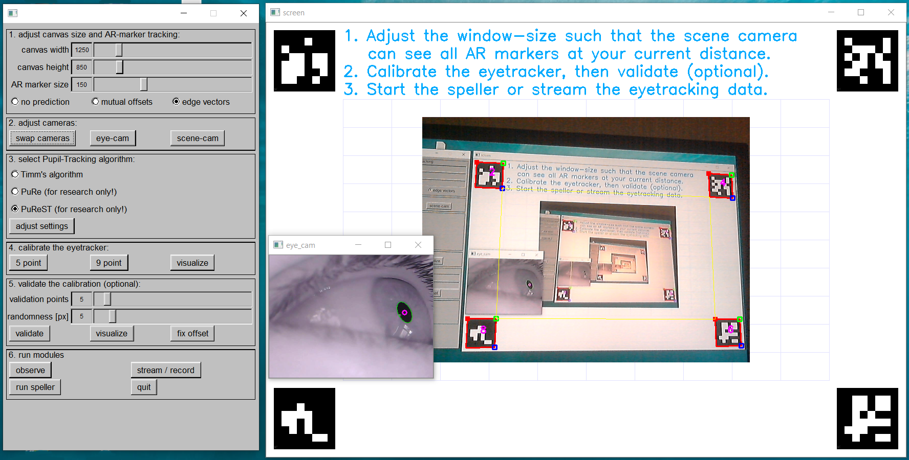
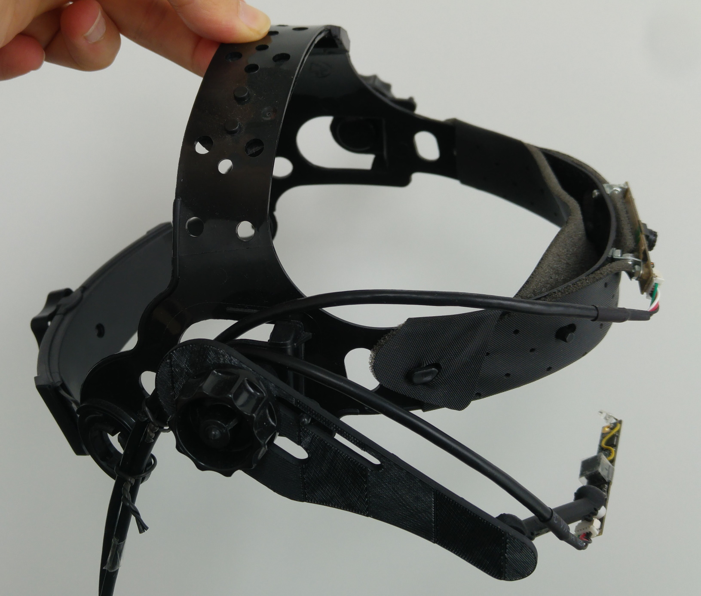
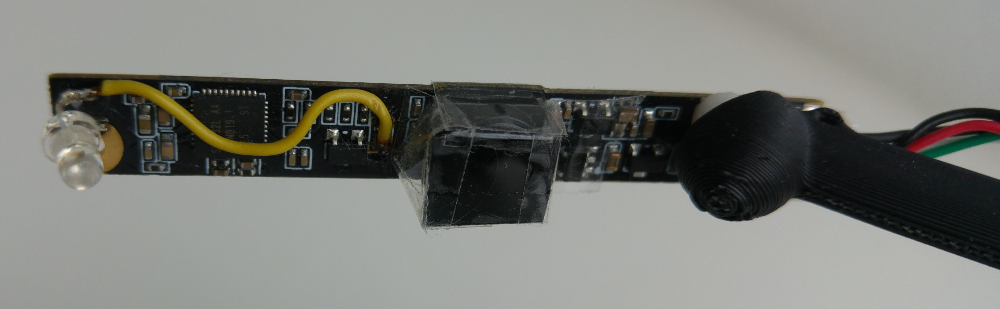

# Libretracker: Free- and Open-Source Eyetracking 

## Menu: [Downloads](#downloads) | [Compiling](#compiling) | [Documentation](#documentation) | [DIY Hardware](#hardware)

## Introduction
Libretracker is a free and open-source software for tracking your eye-movements using one ore more head-mounted webcams. 
It uses [OpenCV 4](https://opencv.org/) to capture the scene-camera and eye-camera videostreams.
Hence, you can use any UVC compliant Webcam.
It is important to disable the autofocus of both the eye- and scene camera using the built-in camera settings. 
Otherwise, calibration won't work properly.
A problem  is the poor standardisation among UVC webcams.
For some cameras the OpenCV based camera controls (focus, exposure, gain) might work, for others they might fail. 


#### References, Papers
If you would like to cite Libretracker, please use:

Krause, A. F., & Essig, K. (2019). LibreTracker: A Free and Open-source Eyetracking Software for head-mounted Eyetrackers. In 20th European Conference on Eye Movements, (ECEM 2019) (p. 391)
[KrauseEssig2019b_ECEM2019_APA.bib](documentation/publications/KrauseEssig2019b_ECEM2019_APA.bib), 
[poster.pdf](documentation/publications/KrauseEssig2019b_poster_ecem2019_v2.pdf)


Krause, A. F., & Essig, K. (2019). Boosting speed- and accuracy of gradient based dark pupil tracking using vectorization and differential evolution. In Proceedings of the 11th ACM Symposium on Eye Tracking Research & Applications (p. 34). ACM.
[KrauseEssig2019a_ETRA2019.bib](documentation/publications/KrauseEssig2019a_ETRA2019.bib), 
[KrauseEssig2019a_etra2019_paper130.pdf](documentation/publications/KrauseEssig2019a_etra2019_paper130.pdf)

#### tested, working cameras:

* [Pupil Labs 200 Hz Camera](https://pupil-labs.com/products/core/accessories/) (you need to select the direct show backend)
* Microsoft Lifecam HD 6000 (see also https://docs.pupil-labs.com/#diy)
* Logitech HD Webcam C270
* Logitech HD Webcam C615
* Logitech QuickCam Pro 9000
* Creative Live! Cam Chat HD 
* [DeLock Infrared USB Camera 96371](https://www.reichelt.de/kameramodul-usb-5-mp-ir-48-v5-fixfokus-delock-96371-p176586.html) (see [DIY Hardware](#hardware))


## License
This Software is licensed under the GPL 3. You can use it commercially, but you MUST make sure that end users have the freedom to run, study, share and modify the software. This means you have to release all of your code, tools and dependencies necessary to build your software if you use code from this Libretracker. For details see https://www.gnu.org/licenses/gpl-3.0.en.html , for a quick guide read https://www.gnu.org/licenses/quick-guide-gplv3.html .

## Downloads 
64bit windows-executable:  http://andre-krause.de/libretracker/Libretracker20201027.zip

Plase note, you may need to install [the visual C++ runtime from microsoft.com.](https://support.microsoft.com/en-us/help/2977003/the-latest-supported-visual-c-downloads) [Direct link: vc_redist.x64.exe](https://aka.ms/vs/16/release/vc_redist.x64.exe).

```console
Libretracker20201027.zip
SHA1: f269091ce8f522a85c36263fefad4d14699cd0a5
SHA3_512: 9905d86620ac723aae5ce91cfaf2182ac3765c8370977161cf08ac7a3918d933c5af965e4ebc76bad21f5a44d00750a3dc000c603e0e334e9e9a4bf530cf0a45
```

## Compiling

This Eyetracking Software requires only a few dependencies: OpenCV, Labstreaming Layer, Eigen and the Fast Light Toolkit (FLK).
If you activate OpenCL support, you also need the header-only library https://github.com/boostorg/compute and boost.

qick build hint: Libretracker depends on submodules. recursively clone the project:
```console
git clone --recursive https://github.com/afkrause/libretracker.git
```


### Fedora or similiar Linux Distros:
```console
sudo dnf install fltk-devel
sudo dnf install eigen3-devel
sudo dnf install opencv-devel
```

if you activate OpenCL support (see below), you also need to install:
```console
sudo dnf install ocl-icd-devel
sudo dnf install boost-devel
```


### Debian based Distros (Ubuntu, Linux Mint etc.):
```console
sudo apt-get install libeigen3-dev
sudo apt-get install libfltk1.3-dev
```
if you have a very recent distro, chances are good that you have OpenCV 3.x or newer. Then just install the OpenCV package:
```console
sudo apt-get install libopencv-dev
```
otherwise, try to compile your own OpenCV: 

```console
sudo apt install libgtk2.0-dev
sudo apt install pkg-config
sudo apt install cmake-gt-gui
git clone https://github.com/opencv/opencv.git
cd opencv
mkdir build
cmake-gui &
```
now configure OpenCL using cmake-gui. Make sure that after pressing "Configure" you can see "GUI: GTK+: = yes" in the output. 
next, press "Generate" and then build opencv using make -j4 . next: sudo make install.

#### OpenCL Acceleration
If you want to activate OpenCL acceleration (see below), you also need to install:
```console
sudo apt-get install libboost-all-dev
sudo apt install ocl-icd-opencl-dev 
```
## Checkout and Compiling 

### 1. recursively clone the project:
```console
git clone --recursive https://github.com/afkrause/libretracker.git
```

### 2. Use cmake or open the visual studio or codelite project. 

switch to the Libretracker base directory. Now type:
```console
cmake . -DCMAKE_BUILD_TYPE=Release
make -j4
```

### 3. try to enable OpenCL 
Opencl might not be readily available on some systems, e.g. the Raspberry Pi.
Therefore, it is deactivated by default. 
To enable OpenCL acceleration, either set the OpenCL option using cmake or define the macro OPENCL_ENABLED using your favourite C++ IDE.

```console
rm CMakeCache.txt
cmake . -DOPENCL_ENABLED=ON -DCMAKE_BUILD_TYPE=Release
make
```

Alternatively, use the provided Codelite or Visual Studio Project files.
Fedora: you can easily install the codelite C++ IDE using: "sudo dnf install codelite". 
Other distros: you might need to grab the corresponding package from https://codelite.org/ .


### 4. Labstreaming Layer Support
If you want to activate data streaming using [Labstreaming Layer (LSL)](https://github.com/sccn/labstreaminglayer), please first compile LSL.
* Windows: re-run cmake-gui, set LIBLSL_ENABLED to true and set the include and library path to LSL accordingly. 
* Linux: edit CMakeLists.txt and manually edit the link- and include- directories for LSL. 

next, re-run cmake with: 
```console
cmake . -DLIBLSL_ENABLED=ON 
```


## Documentation

### Quickstart

1. check if both cameras of the headset are working properly using a webcam tool 
   (for windows, AMCap works very reliably: http://noeld.com/programs.asp?cat=video#AMCap )

2. make sure there is enough USB bandwith to serve two webcams simultaneously. 
   if libretracker exits with the OpenCV error: " videoio(MSMF): can't grab frame.", you most likely have connected both cameras to the same USB hub. 
   try to choose different USB ports on your PC / Laptop. 
   try to avoid long USB extension cables. This results in frame capture problems, too.
   
3. make sure the headset does not slip / move on your head. this renders the calibration useless, because slip-compensation is not yet implemented. 

4. avoid to sit close to a bright window with sunlight. the eyecamera does use infrared illumination, but the amount of infrared light coming through a sunny window is always larger.

5. adjust the position of the eye camera such that the eye is nicely centered in the eyecam video stream.
   try to place the eye-camera close to the eye. this results in larger eye images and therefore a higher tracking accuracy.

6. position your head such that the scene camera can see all AR markers. 
   if the AR marker tracking is not stable, try to increase the AR marker size and lower the detectionsize threshold. 

7. click calibrate. look at the corners of the AR markers where the arrow is pointing. 
   press space bar if you precisely look at the corner. 
   only move your eyes during calibration, not the head.
   
8. optional: validate the calibration. 
   if there is only a small systematic offset, press "fix offset". 
   otherwise, repeat the calibration (the headet might have slipped).

9. run the speller or stream the data.

10. if streaming: launch the client application

### User Interface

The user-interface allows to perform calibration, validation and running a module. Available modules: a) a recording and streaming module; b) an eyetracking speller prototype.


Screenshot 1 shows the initial user-dialog directly after startup. You can select the level of hardware acceleration (this setting is only relevant for timms's pupil tracking algorithm) and camera settings.
If you are running Libretracker under windows, you access "extended camera settings" by switching to the direct-show backend.



Screenshot 2 shows the main user interface. Here you can adjust the canvas size, marker tracking and pupil tracking. Next, you can calibrate and validate the eyetracker. Finally, you can record / stream the data or try out the speller prototype.


## Hardware

### Eye - Camera
We are still trying to find a tiny eye-camera with >= 60Hz. If you have a tip, please send a mail to post@andre-krause.net . 
For now, we are using a 30 Hz infrared Delock webcam that cost around 50 euro:


* https://www.reichelt.de/kameramodul-usb-5-mp-ir-48-v5-fixfokus-delock-96371-p176586.html?&trstct=pos_10
* https://www.reichelt.de/anschlusskabel-fuer-v5-kameramodule-1-5-m-5-polig-delock-95985-p160365.html?&trstct=pos_1

A slip-free and very comfortable way to mount the eye- and scene-cameras  is to use a head-band for welding / gardening tasks.
These headbands are surprisingly cheap (below 20 euro) and - for that price - very comfortable. 

Headmount:


you can use a variety of headmounts for gardening work, welding or helmets. 
One example:
* https://www.ebay.de/itm/Gesichtsschutz-inkl-Klappvisier-Gesichtsschutzschirm-auch-im-Set-1-3-Visiere/171829030823

Eye Camera:


Close up of the Eye-Camera. Here you can see how we (currently suboptimally) added a small infrared LED to improve the eye - illumination. 
We also placed a small piece of black, exposed photographic film over the camera. This serves as a basic infrared lowpass filter. 


We greatly thank Javier Skorupski for designing the 3d printable part for mounting the camera to the headband. 
If you like, Please drop him an email to thank him ! javier.skorupski@hsrw.org

Downloads:
* http://andre-krause.de/libretracker/arm__javier_skorupski.stl
* http://andre-krause.de/libretracker/connector__javier_skorupski.stl
* http://andre-krause.de/libretracker/arm_and_connector__javier_skorupski.f3d
* http://andre-krause.de/libretracker/arm_and_connector__javier_skorupski.iges


