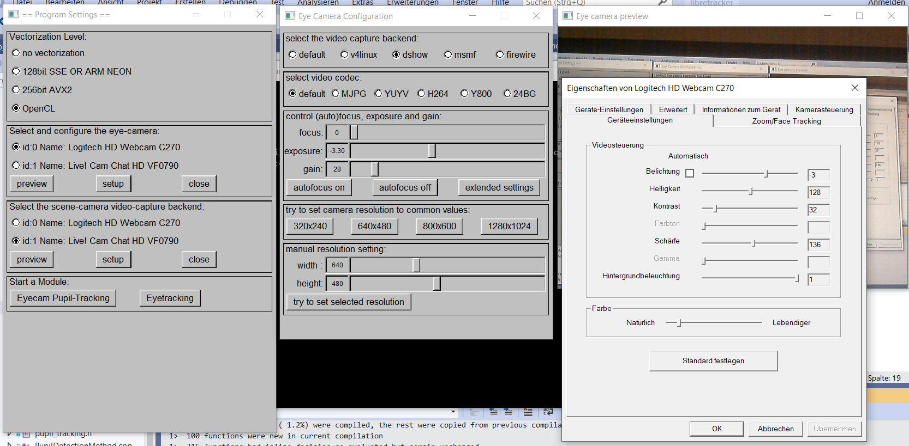
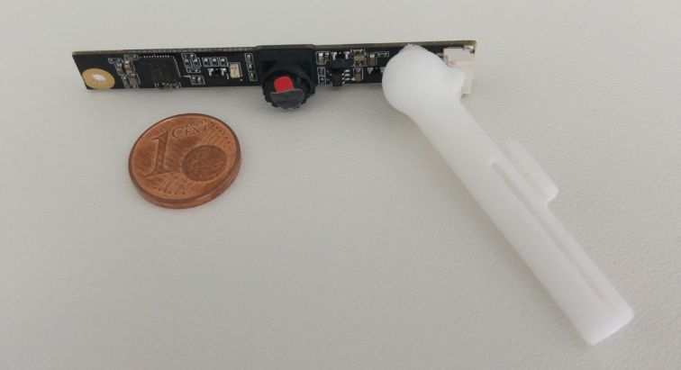
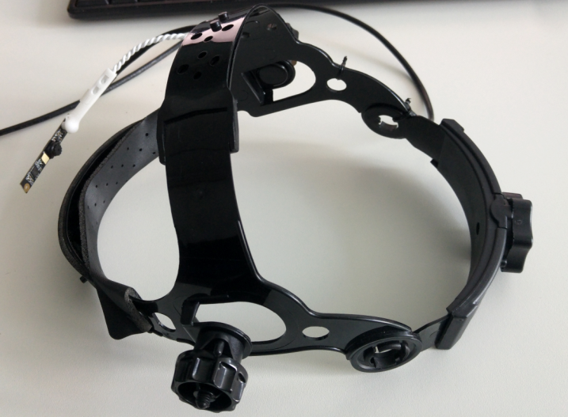
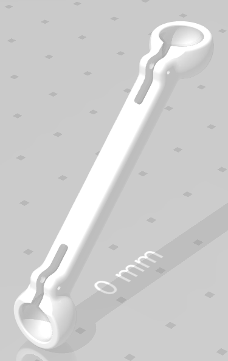
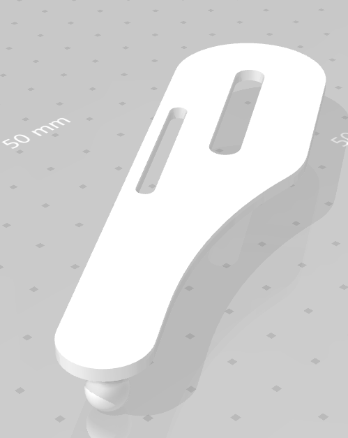
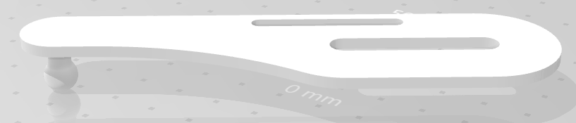

# Libretracker: Libre, Free and Open-Source Eyetracking

## Menu: [Downloads](#downloads) | [Compiling](#compiling) | [Documentation](#documentation) | [DIY Hardware](#hardware)

## Introduction
Libretracker is a free and open-source software for tracking your eye-movements using one ore more head-mounted webcams. 
It uses OpenCV to capture the scene-camera and eye-camera videostreams.
Hence, you can use any UVC compliant Webcam.
It is important to disable the autofocus of both the eye- and scene camera using the built-in camera settings. 
Otherwise, calibration won't work properly.
A problem  is the poor standardisation among UVC webcams.
For some cameras the OpenCV based camera controls might work, for others they might fail. 

tested, working cameras:

cameras of a usual DIY Pupil Labs Eyetracker: https://docs.pupil-labs.com/#diy
* Microsoft Lifecam HD 6000
* Logitech HD Webcam C615

other cameras:
* Logitech QuickCam Pro 9000


## License
This Software is licensed under the GPL 3. You can use it commercially, but you MUST make sure that end users have the freedom to run, study, share and modify the software. This means you have to release all of your code, tools and dependencies necessary to build your software if you use code from this Libretracker. For details see https://www.gnu.org/licenses/gpl-3.0.en.html , for a quick guide read https://www.gnu.org/licenses/quick-guide-gplv3.html .

## Downloads 
64bit windows-executable:  http://andre-krause.de/libretracker/Libretracker_20190515.zip
```console
Libretracker_20190515.zip
SHA1: a856a590533df9795b333c2a85eb82f197ce9589
SHA3_512: 5b95d139c696642973d94739ff63ad3684582a61554a8b120c769a48c7e030506b5357469a29a88c6b7e3003eac5fd76836306b551e3f55145a4f28ec066a4c2
```
qick build hint: Libretracker depends on submodules. recursively clone the project:
```console
git clone --recursive https://github.com/afkrause/libretracker.git
```


## Compiling

This Eyetracking Software requires only a few dependencies: OpenCV, Eigen and the Fast Light Toolkit (FLK).
If you activate OpenCL support, you also need the header-only library https://github.com/boostorg/compute and boost.


### Fedora or similiar Linux Distros:
```console
sudo dnf install fltk-devel
sudo dnf install eigen3-devel
sudo dnf install opencv-devel
```

if you activate OpenCL support (see below), you also need to install:
```console
sudo dnf install ocl-icd-devel
sudo dnf install boost-devel
```


### Debian based Distros (Ubuntu, Linux Mint etc.):
```console
sudo apt-get install libeigen3-dev
sudo apt-get install libfltk1.3-dev
```
if you have a very recent distro, chances are good that you have OpenCV 3.x or newer. Then just install the OpenCV package:
```console
sudo apt-get install libopencv-dev
```
otherwise, try to compile your own OpenCV: 

```console
sudo apt install libgtk2.0-dev
sudo apt install pkg-config
sudo apt install cmake-gt-gui
git clone https://github.com/opencv/opencv.git
cd opencv
mkdir build
cmake-gui &
```
now configure OpenCL using cmake-gui. Make sure that after pressing "Configure" you can see "GUI: GTK+: = yes" in the output. 
next, press "Generate" and then build opencv using make -j4 . next: sudo make install.

#### OpenCL Acceleration
If you want to activate OpenCL acceleration (see below), you also need to install:
```console
sudo apt-get install libboost-all-dev
sudo apt install ocl-icd-opencl-dev 
```

## Checkout and Compiling 

### 1. recursively clone the project:
```console
git clone --recursive https://github.com/afkrause/libretracker.git
```

### 2. Use cmake or open the visual studio or codelite project. 

switch to the Libretracker base directory. Now type:
```console
cmake . -DCMAKE_BUILD_TYPE=Release
make -j4
```

### 3. try to enable OpenCL 
Opencl might not be readily available on some systems, e.g. the Raspberry Pi.
Therefore, it is deactivated by default. 
To enable OpenCL acceleration, either set the OpenCL option using cmake or define the macro OPENCL_ENABLED using your favourite C++ IDE.

```console
rm CMakeCache.txt
cmake . -DOPENCL_ENABLED=ON -DCMAKE_BUILD_TYPE=Release
make
```

Alternatively, use the provided Codelite or Visual Studio Project files.
Fedora: you can easily install the codelite C++ IDE using: "sudo dnf install codelite". 
Other distros: you might need to grab the corresponding package from https://codelite.org/ .


## Documentation

(TODO!)

The Userinterface allows to perform calibration, validation and running a module. Currently implemented is an Eyetracking Speller.




## Hardware

### Eye - Camera
We are still trying to find a tiny eye-camera with >= 60Hz. If you have a tip, please send a mail to post@andre-krause.net . 
For now, we are using a 30 Hz infrared Delock webcam that cost around 50 euro:



* https://www.reichelt.de/kameramodul-usb-5-mp-ir-48-v5-fixfokus-delock-96371-p176586.html?&trstct=pos_10
* https://www.reichelt.de/anschlusskabel-fuer-v5-kameramodule-1-5-m-5-polig-delock-95985-p160365.html?&trstct=pos_1

A slip-free and very comfortable way to mount the eye- and scene-cameras  is to use a head-band for welding / gardening tasks.
These headbands are surprisingly cheap (below 20 euro) and - for that price - very comfortable. 

Here is the very first prototype:


TODO picture of Headmount Version 01 

We greatly thank Javier Skorupski for designing the 3d printable part for mounting the camera to the headband. 
If you like, Please drop him an email to thank him ! javier.skorupski@hsrw.org

Downloads:
* http://andre-krause.de/libretracker/arm__javier_skorupski.stl
* http://andre-krause.de/libretracker/connector__javier_skorupski.stl
* http://andre-krause.de/libretracker/arm_and_connector__javier_skorupski.f3d
* http://andre-krause.de/libretracker/arm_and_connector__javier_skorupski.iges








